# ER Diagram AGATA - Con Dettaglio Campi

## Formato Mermaid (Per Draw.io / Mermaid Editor)

```mermaid
erDiagram

    USERS ||--o{ ASSOCIATIONS : has
    USERS ||--o{ OAUTH_TOKENS : has
    USERS ||--o{ MAGIC_LINK_TOKENS : has
    USERS ||--o{ USER_SESSIONS : has
    USERS ||--o{ PROJECTS : assigned_to
    USERS ||--o{ PROJECTS : reviewed_by
    USERS ||--o{ PROJECTS : submitted_by
    USERS ||--o{ PROJECTS : cancelled_by
    USERS ||--o{ STAR_ASSIGNMENTS : assigned_by
    USERS ||--o{ PROJECT_SCIENCE_DATA : uploaded_by
    USERS ||--o{ PROJECT_SCIENCE_DATA : updated_by
    USERS ||--o{ PROJECT_OUTPUTS : uploaded_by
    USERS ||--o{ CATALOG_IMPORTS : requested_by
    USERS ||--o{ AUDIT_LOG : action_by
    USERS ||--o{ KB_SEARCH_HISTORY : searched_by
    USERS ||--o{ KB_SYNC_STATUS : synced_by
    USERS ||--o{ VAST_JOBS : requested_by
    USERS ||--o{ SYSTEM_CONFIG : updated_by
    USERS ||--o{ SLACK_CHANNELS : created_by

    ASSOCIATIONS ||--o{ PROJECTS : owns
    ASSOCIATIONS ||--o{ STAR_ASSIGNMENTS : owns
    ASSOCIATIONS ||--o{ SLACK_CHANNELS : has
    ASSOCIATIONS ||--o{ CATALOGHI_ESTERNI : owns
    ASSOCIATIONS ||--o{ KB_SYNC_STATUS : scoped_to

    PROJECTS ||--|| PROJECT_SCIENCE_DATA : has
    PROJECTS ||--o{ PROJECT_OUTPUTS : generates
    PROJECTS ||--o{ PROJECT_SLACK_THREADS : maps_to
    PROJECTS ||--o{ VAST_RESULTS : receives
    PROJECTS ||--o{ STAR_ASSIGNMENTS : created_from
    PROJECTS ||--o{ CATALOG_IMPORTS : created_from

    STAR_ASSIGNMENTS ||--|| PROJECTS : becomes

    CATALOG_IMPORTS ||--o{ CATALOGHI_ESTERNI : populates
    CATALOGHI_ESTERNI ||--o{ CATALOG_IMPORTS : imported_by
    CATALOGHI_ESTERNI ||--o{ CATALOG_ATTRIBUTES : described_by

    VAST_JOBS ||--o{ VAST_RESULTS : generates
    VAST_RESULTS ||--o{ PROJECTS : becomes_project

    PROJECT_OUTPUTS ||--o{ PROJECT_OUTPUTS : replaces

    SLACK_CHANNELS ||--o{ PROJECT_SLACK_THREADS : hosts

    USERS {
        string id PK
        string email UK
        string name
        string surname
        string avatar_url
        string provider
        string provider_user_id
        int is_internal
        int association_id FK
        string role
        int is_active
        int email_verified
        timestamp created_at
        timestamp last_login
        string last_login_ip
    }

    ASSOCIATIONS {
        int id PK
        string name UK
        string slug UK
        string type
        int is_active
        string referente_email
        string referente_name
        string slack_namespace
        int slack_enabled
        timestamp created_at
        timestamp updated_at
        text settings
    }

    OAUTH_TOKENS {
        int id PK
        string user_id FK
        string provider
        text access_token
        text refresh_token
        string token_type
        timestamp expires_at
        text scope
        timestamp created_at
        timestamp updated_at
    }

    MAGIC_LINK_TOKENS {
        int id PK
        string token UK
        string email
        string user_id FK
        int is_used
        datetime created_at
        datetime expires_at
        datetime used_at
        string created_ip
        string used_ip
    }

    USER_SESSIONS {
        string id PK
        string user_id FK
        text session_data
        string ip_address
        text user_agent
        timestamp created_at
        timestamp last_activity
        timestamp expires_at
    }

    PROJECTS {
        int id PK
        string project_code UK
        string gaia_id
        int tic_id
        int association_id FK
        string title
        string source
        double ra
        double dec_deg
        float magnitude
        float tic_magnitude
        string spectral_class
        string teff
        string distance
        string luminosity
        string radius
        string mass
        string color_bv
        string color_bprp
        string variable_type
        text catalog_identifiers
        string variability_amplitude
        string passband
        double period
        double epoch
        string state
        string assigned_to FK
        timestamp assigned_at
        string reviewed_by FK
        timestamp reviewed_at
        text review_notes
        timestamp submitted_aavso_at
        string submitted_aavso_by FK
        text aavso_response
        timestamp aavso_accepted_at
        timestamp aavso_rejected_at
        timestamp cancelled_at
        string cancelled_by FK
        text cancellation_reason
        timestamp created_at
        timestamp updated_at
        text data
        text notes
    }

    PROJECT_SCIENCE_DATA {
        int id PK
        int project_id FK
        string dataset_drive_url
        string dataset_type
        timestamp dataset_uploaded_at
        string dataset_uploaded_by FK
        text dataset_notes
        string classification
        double period_days
        double period_uncertainty
        double epoch_jd
        float amplitude_mag
        string confidence_level
        text scientific_notes
        text analysis_method
        text additional_data
        timestamp created_at
        timestamp updated_at
        string updated_by FK
    }

    PROJECT_OUTPUTS {
        int id PK
        int project_id FK
        string output_type
        string file_name
        string file_url
        bigint file_size_bytes
        string mime_type
        text description
        string tags
        int version
        int is_current
        int replaces_output_id FK
        string uploaded_by FK
        timestamp uploaded_at
    }

    PROJECT_SLACK_THREADS {
        int id PK
        int project_id FK
        string channel_id
        string thread_ts
        string message_ts
        string slack_type
        string last_message_ts
        text last_message_preview
        string current_state
        timestamp created_at
        timestamp updated_at
        int is_active
    }

    STAR_ASSIGNMENTS {
        int id PK
        string gaia_id
        int association_id FK
        string assigned_by FK
        datetime assigned_at
        text notes
        int project_id FK
    }

    SLACK_CHANNELS {
        int id PK
        int association_id FK
        string channel_id UK
        string channel_name
        string team_id
        string channel_type
        string created_by FK
        timestamp created_at
        int is_active
        text settings
    }

    CATALOGHI_ESTERNI {
        bigint catalog_index PK
        double hjd
        double Vmag
        bigint Source
        text catalogo
        int association_id_owner FK
        int catalog_import_id FK
    }

    CATALOG_IMPORTS {
        int id PK
        string search_type
        string search_value
        float search_radius_arcsec
        double resolved_ra
        double resolved_dec
        string resolved_gaia_id
        text catalogs_queried
        int total_points_available
        int total_points_imported
        text selected_catalogs
        string state
        text error_message
        string requested_by FK
        int project_id FK
        int target_association_id FK
        datetime created_at
        datetime completed_at
        text notes
    }

    CATALOG_ATTRIBUTES {
        int id PK
        string gaia_id
        string catalog_id
        string attribute_name
        string contesto
        text reference
        string value
        string value_type
        double ra_deg
        double dec_deg
        float distance_arcsec
        datetime fetched_at
        datetime expires_at
    }

    AUDIT_LOG {
        bigint id PK
        string user_id FK
        string user_email
        int association_id
        string action
        string entity_type
        string entity_id
        text old_value
        text new_value
        text description
        string ip_address
        text user_agent
        string request_id
        text slack_payload
        string outcome
        text error_message
        timestamp created_at
    }

    SYSTEM_CONFIG {
        string config_key PK
        text config_value
        string config_type
        text description
        int is_public
        int is_editable
        timestamp created_at
        timestamp updated_at
        string updated_by FK
    }

    KB_SEARCH_HISTORY {
        bigint id PK
        string user_id FK
        text query
        int results_count
        text sources_used
        string clicked_result_id
        int search_duration_ms
        timestamp created_at
    }

    KB_SYNC_STATUS {
        int id PK
        string source
        string user_id FK
        int association_id FK
        timestamp last_sync_at
        int total_items_indexed
        int items_added_last_sync
        string sync_status
        text error_message
        text config
        timestamp created_at
        timestamp updated_at
    }

    VAST_JOBS {
        int id PK
        string job_code UK
        string target_name
        double target_ra
        double target_dec
        string source_type
        text source_location
        string processing_params
        string state
        int progress_pct
        string current_step
        int images_downloaded
        int images_solved
        int candidates_found
        int stars_uploaded
        string downloaded_files
        string output_files
        text error_message
        int retry_count
        string requested_by FK
        int project_id FK
        datetime created_at
        datetime started_at
        datetime completed_at
    }

    VAST_RESULTS {
        int id PK
        int job_id FK
        string vast_id
        bigint gaia_source_id
        double ra
        double decl
        float mean_mag
        float mag_err
        float std_dev
        int num_observations
        float variability_index
        float chi_squared
        float period
        string variability_indices
        float x_pix
        float y_pix
        int is_valid
        int is_known_variable
        string variable_type
        string catalog_matches
        float vmag
        text candidate_flag
        string gaia_match
        string vsx_match
        string atlas_match
        int project_id FK
        datetime created_at
    }
```

## Schema Semplificato per Draw.io

Se preferisci un formato SVG/Draw.io nativo, puoi copiare il codice Mermaid sopra direttamente in:
1. **[Mermaid Live Editor](https://mermaid.live)** - Converter online
2. **[Draw.io](https://draw.io)** - Importa via "Extensions > Mermaid" o copia SVG esportato

## Legenda Simboli

| Simbolo | Significato |
|---------|------------|
| `PK` | Primary Key |
| `FK` | Foreign Key |
| `UK` | Unique Key |
| `CK` | Composite Key (parte di chiave composita) |
| `||--o{` | One-to-Many relationship |
| `\|\|--\|\|` | One-to-One relationship |

## Tabelle Principali per Dominio

### 🔐 Autenticazione & Sessioni
- `agata_users` - Utenti AGATA (OAuth Google)
- `agata_oauth_tokens` - Token OAuth (Google, Slack, GitHub)
- `agata_magic_link_tokens` - Link autenticazione monouso
- `agata_user_sessions` - Sessioni attive

### 📊 Organizzazione
- `agata_associations` - Enti/Organizzazioni (AstroGen APS, partner, scuole)
- `agata_users` (has association_id)

### 🌟 Progetti & Workflow
- `agata_projects` - Progetti workflow stelle variabili (incoming → submitted_aavso)
- `agata_project_science_data` - Dati scientifici per progetto (1:1)
- `agata_project_outputs` - Output scientifici (immagini, fit, report)
- `agata_project_slack_threads` - Mapping progetto ↔ Slack thread
- `agata_star_assignments` - Assegnazione stelle prima di diventare progetti

### 📚 Cataloghi
- `Cataloghi_esterni` - Bacino centrale fotometria da cataloghi (TESS, ZTF, ASASSN, OGLE)
- `agata_catalog_imports` - Sessioni importazione (pending → completed)
- `agata_catalog_attributes` - Cache persistente attributi Vizier (180gg TTL)

### 🤖 VAST Automation
- `agata_vast_jobs` - Job elaborazione immagini (pending → completed)
- `agata_vast_results` - Candidati stelle variabili trovate da VAST (690+ per job)

### 💬 Slack Integration
- `agata_slack_channels` - Canali Slack fissi (coord, lavori, review)
- `agata_project_slack_threads` - Mapping progetti → Slack thread

### 📊 Sistema & Audit
- `agata_system_config` - Key-value store configurazioni di sistema
- `agata_audit_log` - Tracciamento tutte le azioni (compliance)

### 🧠 Knowledge Base
- `agata_kb_search_history` - Cronologia ricerche semantiche
- `agata_kb_sync_status` - Stato sincronizzazione sorgenti (MBOX, Google Drive, etc.)

## Statistiche

| Aspetto | Dato |
|---------|------|
| **Tabelle AGATA** | 18 |
| **Foreign Keys** | 40+ |
| **Enum Types** | 11 |
| **Tabelle Legacy** | 25+ |
| **Viste** | 3 |

---

**Generato**: 2026-02-19
**Formato**: Mermaid ER Diagram con dettaglio campi completo
**Per Draw.io**: Copia il codice Mermaid in [mermaid.live](https://mermaid.live) e esporta come SVG
