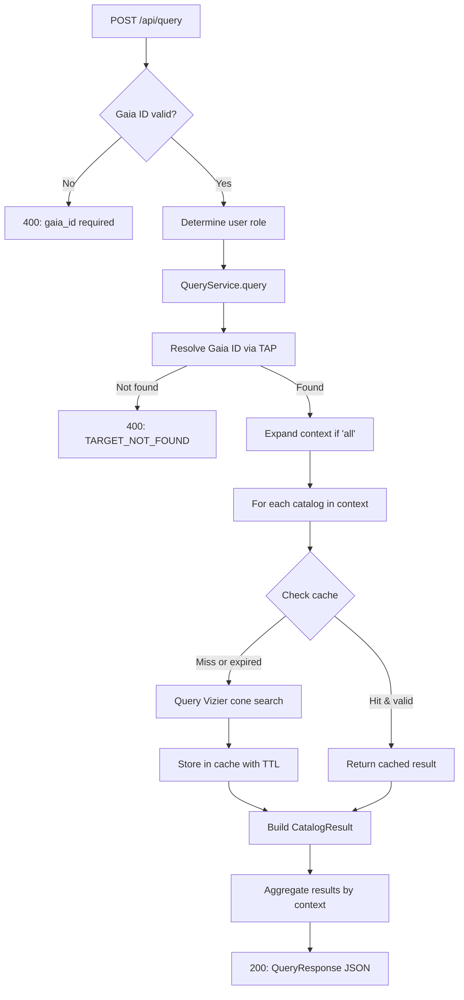

# Catalog Integration - Interrogazione Cataloghi Esterni

**Data creazione**: 2026-02-12
**Versione**: 1.0.0
**Stato**: ✅ Completato e Funzionante

---

## 📋 Indice

1. [Panoramica](#panoramica)
2. [Architettura](#architettura)
3. [Implementazione](#implementazione)
4. [Utilizzo](#utilizzo)
5. [API Reference](#api-reference)
6. [Database & Cache](#database--cache)
7. [Troubleshooting](#troubleshooting)
8. [Future Enhancements](#future-enhancements)

---

## Panoramica

Il modulo **Catalog Integration** fornisce un'interfaccia unificata per interrogare cataloghi astronomici esterni (Gaia, Vizier, VSX, TESS, etc.) partendo da un **Gaia DR3 Source ID**.

### 🎯 Obiettivi

- **Integrazione seamless** nell'editor Variable Stars
- **Query multi-catalogo** organizzate per contesto semantico
- **Cache intelligente** con TTL differenziato
- **Supporto multi-scenario**: progetti esistenti + query ad-hoc (superuser)

### ✨ Features

- ✅ **6 contesti interrogabili**: identificativi, parametri fisici, magnitudine, tipo spettrale, variabilità nota, tutti
- ✅ **Cache in-memory** con TTL (180 giorni per match, 365 giorni per no-match)
- ✅ **Gestione graceful** di timeout/errori Vizier
- ✅ **UI responsive** con status real-time e payload espandibile
- ✅ **RBAC**: Analyst+ può interrogare, Superuser può forzare refresh

---

## Architettura

### 📂 Struttura Directory

```
agata/catalog/
├── __init__.py                    # Blueprint definition
├── flask_routes.py                # Flask HTTP wrapper (POST /api/query)
├── api/
│   ├── __init__.py
│   └── routes.py                  # Entry point: post_query(service, gaia_id, ...)
├── domain/
│   ├── __init__.py
│   ├── models.py                  # QueryResponse, CatalogResult, ResolvedTarget, CacheEntry
│   └── enums.py                   # Context, CatalogStatus, RequestStatus, UserRole
├── repositories/
│   ├── __init__.py
│   ├── registry_repo.py           # In-memory catalog registry
│   ├── cache_repo.py              # In-memory query cache (TTL-based)
│   ├── events_repo.py             # In-memory audit log
│   └── catalog_registry_generated.py  # CSV-driven catalog loader
└── services/
    ├── __init__.py
    ├── query_service.py           # QueryService: orchestrates catalog queries
    ├── vizier_client.py           # Wrapper per astroquery.Vizier
    └── cache_policy.py            # TTL computation and cache expiration
```

### 🏗️ Design Patterns

| Pattern | Implementazione | Scopo |
|---------|-----------------|-------|
| **Repository Pattern** | `InMemoryRegistryRepo`, `InMemoryCacheRepo`, `InMemoryEventsRepo` | Separazione persistenza da business logic |
| **Service Layer** | `QueryService` | Orchestrazione query multi-catalogo |
| **Dependency Injection** | Repos/Vizier passati al costruttore `QueryService` | Testability e flessibilità |
| **Dataclass Models** | `@dataclass(frozen=True)` | Immutabilità dati dominio |
| **Enum-Driven Config** | `Context`, `CatalogStatus`, `UserRole` | Type safety e validazione |
| **TTL-Based Caching** | `compute_expiration(status)` | Riduzione query ridondanti |

---

## Implementazione

### Phase 1: Blueprint Setup

#### 1.1 Blueprint Registration

**File**: `agata/catalog/__init__.py`

```python
from flask import Blueprint

catalog_bp = Blueprint(
    'catalog',
    __name__,
    url_prefix='/agata/catalog'
)

from . import flask_routes
```

**File**: `app.py`

```python
from agata.catalog import catalog_bp

app.register_blueprint(catalog_bp)
```

**Risultato**: Endpoint disponibile a `/agata/catalog/api/query`

#### 1.2 Import Path Fix

**Problema**: Il modulo usava `from inf_da_cataloghi.*` invece di `from agata.catalog.*`

**Soluzione**: Global search/replace con sed

```bash
find agata/catalog -type f -name "*.py" -exec sed -i 's/from inf_da_cataloghi\./from agata.catalog./g' {} +
find agata/catalog -type f -name "*.py" -exec sed -i 's/import inf_da_cataloghi\./import agata.catalog./g' {} +
```

### Phase 2: Frontend Integration

#### 2.1 Template Modifications

**File**: `agata/templates/variable_stars/index.html`

**Location 1**: Tab button (linea ~506)
```html
<button class="tab-btn" onclick="switchTab(event, 'tab-catalogs')">🔭 Cataloghi</button>
```

**Location 2**: Hidden input (linea ~128)
```html
<input type="hidden" id="projectGaiaId" value="{{ project.gaia_id }}" />
```

**Location 3**: Tab panel (linea ~1235)
```html
<div id="tab-catalogs" class="tab-panel">
  <div class="plot-card">
    <!-- Header & Controls -->
    <div style="padding: 1rem; border-bottom: 1px solid var(--border);">
      <h3>🔭 Interrogazione Cataloghi Esterni</h3>

      <!-- Gaia ID (readonly) -->
      <input type="text" id="catalog-gaia-id" readonly />

      <!-- Context Selector -->
      <select id="catalog-context">
        <option value="identificativi">📋 Identificativi</option>
        <option value="parametri_fisici">⚛️ Parametri Fisici</option>
        <option value="magnitudine">💡 Magnitudine</option>
        <option value="tipo_spettrale">🌈 Tipo Spettrale</option>
        <option value="variabilita_nota">📊 Variabilità Nota</option>
        <option value="all">🌐 Tutti i Contesti</option>
      </select>

      <!-- Query Button -->
      <button id="catalog-query-btn" onclick="queryCatalogs()">🔍 Cerca</button>

      <!-- Refresh Checkbox (superuser only) -->
      
      <label>
        <input type="checkbox" id="catalog-refresh" />
        <span>🔄 Force Refresh (bypass cache)</span>
      </label>
      

      <!-- Status Message -->
      <div id="catalog-status" style="display: none;"></div>
    </div>

    <!-- Results Container -->
    <div id="catalog-results">
      <p>Seleziona un contesto e premi "🔍 Cerca"</p>
    </div>
  </div>
</div>
```

#### 2.2 JavaScript Module

**File**: `agata/static/js/variable_stars/catalogs.js`

```javascript
export function initCatalogs() {
  const gaiaIdInput = document.getElementById('catalog-gaia-id');
  if (!gaiaIdInput) return;

  // Priorità 1: project.gaia_id (da hidden input)
  const projectGaiaId = document.getElementById('projectGaiaId')?.value;

  // Priorità 2: URL query parameter (?gaia_id=...)
  const urlParams = new URLSearchParams(window.location.search);
  const urlGaiaId = urlParams.get('gaia_id');

  const gaiaId = projectGaiaId || urlGaiaId;

  if (gaiaId) {
    gaiaIdInput.value = gaiaId;
    console.log(`[Catalogs] Gaia ID loaded: ${gaiaId} (source: ${projectGaiaId ? 'project' : 'URL'})`);
  }
}

window.queryCatalogs = async function() {
  const gaiaId = document.getElementById('catalog-gaia-id')?.value;
  const context = document.getElementById('catalog-context')?.value || 'identificativi';
  const refresh = document.getElementById('catalog-refresh')?.checked || false;

  // API Call
  const response = await fetch('/agata/catalog/api/query', {
    method: 'POST',
    headers: { 'Content-Type': 'application/json' },
    body: JSON.stringify({ gaia_id: gaiaId, context: context, refresh: refresh })
  });

  const data = await response.json();
  displayResults(data);  // Render results in UI
};
```

**File**: `agata/static/js/variable_stars/main.js`

```javascript
import { initCatalogs } from './catalogs.js';

// ...

initCatalogs();  // Initialize module
```

### Phase 3: Flask Route Wrapper

**File**: `agata/catalog/flask_routes.py`

```python
from flask import request, jsonify
from flask_login import login_required, current_user
from agata.admin.decorators import admin_required

from . import catalog_bp
from .api.routes import post_query
from .services.query_service import QueryService
from .repositories.registry_repo import InMemoryRegistryRepo
from .repositories.cache_repo import InMemoryCacheRepo
from .repositories.events_repo import InMemoryEventsRepo
from .repositories.catalog_registry_generated import apply_registry_to_repo

# Singleton instances (in-memory, per-process)
_registry_repo = InMemoryRegistryRepo()
_cache_repo = InMemoryCacheRepo()
_events_repo = InMemoryEventsRepo()

# Load catalogs from CSV
apply_registry_to_repo(_registry_repo)

# Service singleton
_query_service = QueryService(
    registry_repo=_registry_repo,
    cache_repo=_cache_repo,
    events_repo=_events_repo
)

@catalog_bp.route('/api/query', methods=['POST'])
@login_required
@admin_required('analyst')
def api_query_catalogs():
    data = request.get_json()
    gaia_id = data.get('gaia_id')
    context = data.get('context', 'identificativi')
    refresh = data.get('refresh', False)

    if not gaia_id:
        return jsonify({"error": "gaia_id required"}), 400

    # Determine user role (current_user has is_superuser, is_admin properties)
    role = 'superuser' if current_user.is_superuser else 'admin' if current_user.is_admin else 'user'

    try:
        result = post_query(
            service=_query_service,
            gaia_id=str(gaia_id),
            context=context,
            role=role,
            refresh=refresh,
            max_matches=3
        )
        return jsonify(result), 200
    except ValueError as e:
        return jsonify({"error": str(e)}), 400
    except Exception as e:
        return jsonify({"error": f"Query failed: {str(e)}"}), 500
```

---

## Utilizzo

### Scenario 1: Progetto Esistente

**URL**: `/agata/variable-stars/<project_id>`

1. Accedi come **analyst** o superiore
2. Apri un progetto con `gaia_id` popolato
3. Clicca tab **"🔭 Cataloghi"**
4. Il Gaia ID viene caricato automaticamente da `project.gaia_id`
5. Seleziona contesto dal dropdown (es: "Identificativi")
6. Clicca **"🔍 Cerca"**

**Risultato**:
- Query eseguita su tutti i cataloghi del contesto selezionato
- Risultati visualizzati con card per ogni catalogo
- Badge "📦 Cache" se risultato da cache

### Scenario 2: Query Ad-Hoc (Superuser)

**URL**: `/agata/variable-stars/?gaia_id=6774943779933671296`

1. Accedi come **superuser**
2. Accedi all'editor senza progetto, passando `gaia_id` come query parameter
3. Clicca tab **"🔭 Cataloghi"**
4. Il Gaia ID viene caricato automaticamente dall'URL
5. Procedi come scenario 1

**Use Case**: Esplorazione rapida di una stella senza creare un progetto

### Scenario 3: Force Refresh (Superuser)

1. Esegui una query (scenario 1 o 2)
2. Attiva checkbox **"🔄 Force Refresh"** (visibile solo a superuser)
3. Clicca **"🔍 Cerca"**

**Risultato**: Cache bypassata, query eseguite live su Vizier/Gaia

---

## API Reference

### Endpoint: `POST /agata/catalog/api/query`

**Authentication**: `@login_required` + `@admin_required('analyst')`

**Request Body**:
```json
{
  "gaia_id": "6774943779933671296",
  "context": "identificativi",
  "refresh": false
}
```

| Field | Type | Required | Default | Description |
|-------|------|----------|---------|-------------|
| `gaia_id` | `string` | ✅ Yes | - | Gaia DR3/DR2 source ID (19 digits) |
| `context` | `string` | ❌ No | `"identificativi"` | Contesto: `identificativi`, `parametri_fisici`, `magnitudine`, `tipo_spettrale`, `variabilita_nota`, `all` |
| `refresh` | `boolean` | ❌ No | `false` | Force cache refresh (superuser only) |

**Response** (200 OK):
```json
{
  "request_id": "550e8400-e29b-41d4-a716-446655440000",
  "request_status": "complete",
  "context": "identificativi",
  "resolved_target": {
    "gaia_id": "6774943779933671296",
    "gaia_release_used": "dr3",
    "ra_deg": 83.633206,
    "dec_deg": 22.014461
  },
  "results_by_context": {
    "identificativi": [
      {
        "catalog_id": "I/355/gaiadr3",
        "status": "ok",
        "from_cache": false,
        "needs_attention": false,
        "matches_count": 4,
        "payload": {
          "Source": "6774943779933671296",
          "RA_ICRS": 83.633206,
          "DE_ICRS": 22.014461,
          "_candidates": [...]
        },
        "fetched_at": "2026-02-12T21:19:33.123456",
        "expires_at": "2026-08-11T21:19:33.123456",
        "error_message": null
      },
      {
        "catalog_id": "IV/38/tic",
        "status": "ok",
        "from_cache": false,
        "needs_attention": false,
        "matches_count": 1,
        "payload": { "TIC": 123456, "Tmag": 10.5 },
        "fetched_at": "2026-02-12T21:19:33.456789",
        "expires_at": "2026-08-11T21:19:33.456789",
        "error_message": null
      }
    ]
  }
}
```

**Error Responses**:

| Status | Error | Description |
|--------|-------|-------------|
| `400` | `gaia_id required` | Missing Gaia ID in request |
| `400` | `TARGET_NOT_FOUND` | Gaia ID not found in DR3/DR2 |
| `400` | `Invalid context: xyz` | Invalid context enum value |
| `500` | `Query failed: <error>` | Unexpected error (Vizier timeout, network, etc.) |

### Query Flow



---

## Database & Cache

### Repository Pattern (In-Memory)

#### 1. InMemoryRegistryRepo

**Purpose**: Registry dei cataloghi disponibili

**Data Source**: `agata/catalog/cataloghi_gvt.csv` (CSV semicolon-delimited)

**Columns**:
- `contesto` → Context enum (es: "identificativi")
- `catalogo` → Vizier catalog ID (es: "I/355/gaiadr3")
- `chiave_match` → Match strategy ("source_id" o "RA/DEC cone")
- `attributi` → Column names to fetch (comma-separated)
- `reference` → Bibliographic reference
- `condizione d'uso` → Usage terms
- `fonte` → Provider (es: "vizier")

**Storage**:
```python
_catalogs: Dict[str, CatalogDefinition]
_context_catalogs: Dict[Context, List[str]]
```

**Methods**:
- `get_catalog(catalog_id: str) -> CatalogDefinition | None`
- `get_catalogs_for_context(context: Context) -> List[CatalogDefinition]`

#### 2. InMemoryCacheRepo

**Purpose**: Cache delle query con TTL

**Key**: `(gaia_id: str, context: Context, catalog_id: str)`

**Value**: `CacheEntry`
```python
@dataclass(frozen=True)
class CacheEntry:
    status: CatalogStatus  # OK, NO_MATCH, ERROR, TIMEOUT
    matches_count: int
    payload: Dict[str, Any]  # Raw Vizier data
    fetched_at: datetime
    expires_at: datetime
    error_message: str | None
```

**TTL Policy** (`cache_policy.py`):
```python
if status == CatalogStatus.NO_MATCH:
    ttl = 365 days  # Long TTL for negative results
else:
    ttl = 180 days  # Standard TTL for matches
```

**Eviction Rules**:
- Error/timeout results **never** overwrite good cache
- Manual refresh (superuser only) bypasses cache
- `is_expired()` checks `expires_at < now`

**Lifetime**: In-memory, per-process. Restart Flask = cache persa.

#### 3. InMemoryEventsRepo

**Purpose**: Audit log delle query (diagnostics)

**Storage**: `List[QueryEvent]`

```python
@dataclass(frozen=True)
class QueryEvent:
    request_id: str
    gaia_id: str
    context: Context
    event_type: EventType  # QUERY_START, FETCH_OK, FETCH_ERROR, etc.
    timestamp: datetime
    metadata: dict
```

**Lifetime**: In-memory, non esposto via API (solo per debugging interno)

---

## Troubleshooting

### Problema 1: `AttributeError: type object 'User' has no attribute 'query'`

**Causa**: Tentavo di usare `User.query.get()` (SQLAlchemy pattern non disponibile)

**Soluzione**: Usare direttamente `current_user` properties:
```python
# ❌ ERRATO
user = User.query.get(current_user.id)
role = 'superuser' if user.is_superuser else 'user'

# ✅ CORRETTO
role = 'superuser' if current_user.is_superuser else 'admin' if current_user.is_admin else 'user'
```

### Problema 2: `Object of type MaskedConstant is not JSON serializable`

**Causa**: Vizier restituisce `numpy.ma.core.MaskedConstant` per valori mancanti/invalidi

**Soluzione**: Aggiunta gestione in `_json_safe()` (`vizier_client.py`):
```python
def _json_safe(v):
    # MaskedConstant → None (JSON null)
    try:
        import numpy.ma as ma
        if isinstance(v, type(ma.masked)):
            return None
    except Exception:
        pass

    # ... resto conversioni (numpy scalars, Quantity, bytes)
```

### Problema 3: CSV Mancante (`cataloghi_gvt.csv`)

**Sintomo**: Errore al bootstrap del modulo

**Causa**: `apply_registry_to_repo()` richiede CSV per caricare cataloghi

**Soluzione**:
1. Verificare che esista `agata/catalog/cataloghi_gvt.csv`
2. Se mancante, creare file con formato:
```csv
contesto;catalogo;chiave_match;attributi;reference;condizione d'uso;fonte
identificativi;I/355/gaiadr3;source_id;Source,RA_ICRS,DE_ICRS;Gaia DR3;Public;vizier
identificativi;IV/38/tic;RA/DEC cone;TIC,Tmag;TESS Input Catalog;Public;vizier
```

### Problema 4: Gaia TAP Timeout

**Sintomo**: Query Gaia DR3 fallisce con timeout

**Causa**: `Gaia.TIMEOUT = 5` (hardcoded in `query_service.py`)

**Workaround**: Il sistema fallback automaticamente a Gaia DR2

**Soluzione long-term**: Configurabile via env var `GAIA_TIMEOUT_SEC`

### Problema 5: Gaia ID Non Caricato

**Sintomo**: Campo "Gaia DR3 Source ID" vuoto nel tab Cataloghi

**Cause Possibili**:
1. Progetto senza `gaia_id` popolato → Verifica `project.gaia_id` in DB
2. URL senza query parameter → Verifica `?gaia_id=...` in URL
3. Hidden input mancante → Verifica `<input id="projectGaiaId">` in template

**Debug**:
```javascript
console.log('[Catalogs] Gaia ID loaded: ...')  // Check browser console
```

---

---

## UI/UX Features

### Visualizzazione Tabellare Strutturata

**Formato Output**: Invece del JSON raw, i risultati vengono presentati in **tabelle strutturate** per catalogo.

**Struttura Tabella**:

| Colonna | Contenuto | Esempio |
|---------|-----------|---------|
| **Attributo** | Nome campo catalogo | `Teff` (temperatura effettiva) |
| **Valore** | Valore formattato | `5329.3` K |
| **Reference/Note** | Citazione bibliografica | Stassun et al., 2019 |
| **Azione** | Pulsante import | 📥 Importa |

**Features Implementate**:
- ✅ **Auto-formatting valori**: Numeri con max 6 decimali, null/undefined visualizzati come italic
- ✅ **Filtro campi interni**: Esclude `_candidates`, `_RAJ2000`, `_r`, `recno` (metadati Vizier)
- ✅ **Reference lookup**: Mapping statico cataloghi → citazioni bibliografiche
- ✅ **Pulsante "Importa"**: Placeholder per import futuro nei campi progetto
- ✅ **Responsive design**: Tabelle con width percentuali (30/20/40/10%)

**Example Output**:

```
Catalogo: IV/39/tic82 (TESS Input Catalog v8.2)

┌──────────────┬──────────┬─────────────────────────────┬──────────┐
│ Attributo    │ Valore   │ Reference/Note              │ Azione   │
├──────────────┼──────────┼─────────────────────────────┼──────────┤
│ Teff         │ 5329.3   │ Stassun et al., 2019        │ 📥 Importa│
│ Rad          │ 2.558    │ Stassun et al., 2019        │ 📥 Importa│
│ Mass         │ null     │ Stassun et al., 2019        │ 📥 Importa│
│ Dist         │ 1062.6   │ Stassun et al., 2019        │ 📥 Importa│
└──────────────┴──────────┴─────────────────────────────┴──────────┘
```

**Cataloghi con Reference**:

| Catalog ID | Label | Reference |
|------------|-------|-----------|
| `I/355/gaiadr3` | Gaia DR3 | Gaia Collaboration, 2023 |
| `IV/38/tic` | TESS Input Catalog | Stassun et al., 2019 |
| `IV/39/tic82` | TESS Input Catalog v8.2 | Stassun et al., 2019 |
| `II/246/out` | 2MASS | Skrutskie et al., 2006 |
| `I/239/tyc_main` | Tycho-2 | Høg et al., 2000 |
| `I/354/starhorse2021` | StarHorse | Anders et al., 2022 |
| `V/15/catalog` | VSX | Watson et al., 2006 |

**Import Attribute (Placeholder)**:

```javascript
window.importAttribute = function(catalogId, attribute, value) {
  console.log(`Import: ${catalogId}.${attribute} = ${value}`);
  // TODO: API call to update project fields
  alert('Funzionalità non ancora implementata');
};
```

**Future**: Il pulsante "Importa" chiamerà un endpoint per popolare campi progetto:
- `Teff` → `project.teff`
- `Rad` → `project.radius`
- `Mass` → `project.mass`
- `Dist` → `project.distance`

---

## Future Enhancements

### Phase 2: Database Migration

**Obiettivo**: Sostituire in-memory repos con SQLAlchemy models

**Tables da creare**:
```sql
CREATE TABLE agata_catalog_cache (
    id INT AUTO_INCREMENT PRIMARY KEY,
    gaia_id VARCHAR(50) NOT NULL,
    context ENUM('identificativi', 'parametri_fisici', ...) NOT NULL,
    catalog_id VARCHAR(100) NOT NULL,
    status ENUM('ok', 'no_match', 'error', 'timeout') NOT NULL,
    matches_count INT DEFAULT 0,
    payload JSON,
    fetched_at DATETIME NOT NULL,
    expires_at DATETIME NOT NULL,
    error_message TEXT,
    UNIQUE KEY unique_query (gaia_id, context, catalog_id),
    INDEX idx_expires (expires_at)
);

CREATE TABLE agata_catalog_events (
    id INT AUTO_INCREMENT PRIMARY KEY,
    request_id VARCHAR(36) NOT NULL,
    gaia_id VARCHAR(50) NOT NULL,
    context VARCHAR(50) NOT NULL,
    event_type VARCHAR(50) NOT NULL,
    timestamp DATETIME NOT NULL,
    metadata JSON,
    INDEX idx_request (request_id),
    INDEX idx_timestamp (timestamp)
);

CREATE TABLE agata_catalog_registry (
    id INT AUTO_INCREMENT PRIMARY KEY,
    catalog_id VARCHAR(100) UNIQUE NOT NULL,
    context VARCHAR(50) NOT NULL,
    provider VARCHAR(50) NOT NULL,
    match_strategy ENUM('source_id', 'RA_DEC_CONE') NOT NULL,
    default_radius_arcsec FLOAT,
    enabled BOOLEAN DEFAULT TRUE,
    label VARCHAR(255),
    reference TEXT,
    usage_terms TEXT
);
```

**Migration Steps**:
1. Create SQLAlchemy models in `agata/auth_models/`
2. Replace repo implementations (keep same interface)
3. Add Alembic migration script
4. Test with existing code (no API changes)
5. Add cron job for cache cleanup (expired entries)

### Phase 3: UI Enhancements

**Features**:
- **Export Results**: Download catalog data as CSV/JSON
- **Auto-populate Project**: Button to import catalog data into project fields
  - `spectral_class` ← Tipo Spettrale context
  - `teff`, `luminosity`, `radius` ← Parametri Fisici context
  - `magnitude` ← Magnitudine context
- **Catalog Selection**: Allow user to pick specific catalogs instead of context
- **Comparison View**: Side-by-side comparison of multiple Gaia IDs
- **Plot Integration**: Show catalog photometry on light curve plot

### Phase 4: Performance Optimizations

- **Parallel Queries**: Query multiple catalogs concurrently (asyncio)
- **Connection Pooling**: Reuse HTTP connections to Vizier
- **Partial Results**: Stream results as they arrive (Server-Sent Events)
- **Batch Mode**: Query multiple Gaia IDs in one request

### Phase 5: Advanced Features

- **Custom Catalogs**: Allow users to add custom Vizier catalogs
- **Query History**: Track user queries and popular searches
- **Smart Suggestions**: Recommend catalogs based on star type
- **Cross-Match Analysis**: Identify discrepancies across catalogs
- **Notification System**: Alert when cache is about to expire

---

## Versioning & Changelog

### v1.2.0 (2026-02-13) - Unified Table with Filters & Sort

**Added**:
- ✅ **Unified table**: Single table with ALL attributes from ALL catalogs (no più box separati)
- ✅ **Real-time filtering**: Search box filters by catalogo, attributo, valore
- ✅ **Column sorting**: Sort by Catalogo, Attributo (A-Z), Contesto
- ✅ **Catalogs summary**: Footer section with status riepilogo per ogni catalogo
- ✅ **Visible count**: Dynamic counter of visible rows after filtering

**Changed**:
- ❌ **Removed per-catalog boxes**: Unified all results in single sortable/filterable table
- ✨ **Better UX**: Easier to compare attributes across catalogs

### v1.1.0 (2026-02-12) - Tabular UI Enhancement

**Added**:
- ✅ **Tabular structured display**: Results shown as tables with Attributo/Valore/Reference/Azione columns
- ✅ **Auto-formatting values**: Numbers with 6 decimals, null/undefined as italic gray
- ✅ **Catalog reference mapping**: 12 catalogs with bibliographic citations
- ✅ **Import button placeholder**: UI for future attribute import into project
- ✅ **Field filtering**: Excludes internal Vizier metadata (`_candidates`, `_RAJ2000`, etc.)

**Changed**:
- ❌ **Removed JSON preview**: Replaced `<details>` with raw JSON payload
- ✨ **Improved readability**: Structured tables instead of unformatted JSON

### v1.0.0 (2026-02-12) - Initial Release

**Added**:
- ✅ Blueprint registration (`catalog_bp` at `/agata/catalog`)
- ✅ Flask route wrapper with RBAC (analyst+ required)
- ✅ Frontend tab in variable_stars editor
- ✅ JavaScript module with dual Gaia ID source (project + URL)
- ✅ In-memory cache with TTL policy
- ✅ 6 interrogable contexts
- ✅ MaskedConstant JSON serialization fix
- ✅ Graceful error handling (Vizier timeout, Gaia not found)

**Dependencies**:
- `astroquery` >= 0.4.6 (Gaia TAP, Vizier)
- `astropy` >= 5.0 (SkyCoord, units)
- `flask` >= 2.0
- `flask-login` >= 0.6

**Known Limitations**:
- In-memory cache (lost on restart)
- CSV file `cataloghi_gvt.csv` required but not included
- No batch query support
- No catalog customization

---

## Contributors

- **Claude Sonnet 4.5** - Implementation & Documentation
- **Astrogen Team** - Requirements & Testing

---

## License

Proprietario - Astrogen Project
© 2026 Astrogen. Tutti i diritti riservati.

---

## Support

Per bug reports o richieste di feature, aprire una issue su GitHub o contattare il team Astrogen.

**Last Updated**: 2026-02-12 21:30 UTC
